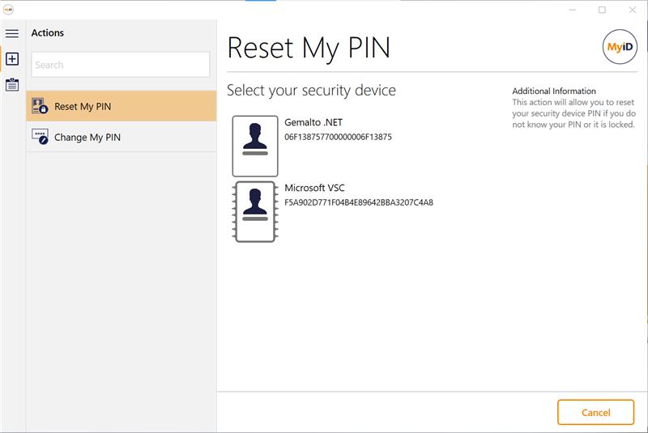

# Bloqueo de VPN

#### Bloqueo de VPN en usuario con teletrabajo

1. Contactarse con el usuario que tiene el problema a través de Teams o algún otro medio de comunicación alternativo.
2. Solicitar una cuenta VPN de emergencia:


Link para solicitar VPN Emergency Account:

[URL](https://lis-task.liebherr.com/servicedesk/customer/portal/3/create/1372)

 (2).png>)


Ejemplo de correo con credenciales de VPN Emergency Account

 (2).png>)

Debemos solicitar al usuario que acceda con las credenciales que obtuvimos a través del link anterior. Las credenciales nos llegarán a nuestro correo corporativo.

* Abrir Cisco AnyConnect -> Liebherr - Employees Emergency

<figure><figcaption></figcaption></figure>

* Ya ingresado con éxito se debe abrir el programa **MyID Self-Service App.**

********

* Ir a Reset My PIN -> Escoger security device -> Ingresar PIN nuevo.

**** (1).png>)****


Solo se puede solicitar una vez al día el VPN de emergencia .

El VPN tiene una duración de 90 minutos.

Se puede utilizar para solucionar varios problemas.


****

****

****
