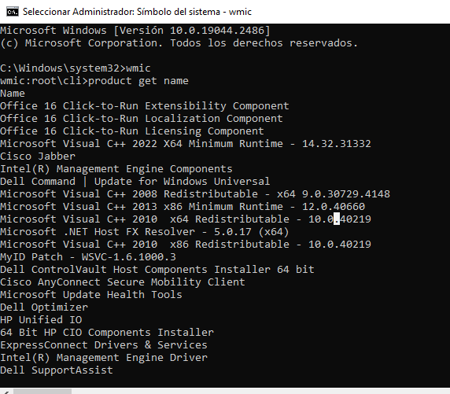

# Corregir error de plugins en Adobe Acrobat Reader PDF

Solución para resolver problema con plugins en **Adobe (19-01-2023):**

<figure><figcaption></figcaption></figure>

### Parte 1 - Desinstalar Adobe Acrobat Reader

Lo primero que debemos hacer es desinstalar la versión que esté instalada en el equipo. Para ello utilizaremos **WMIC**.


```
WMIC
Product get name
Product where name="Adobe Acrobat Reader - Español" call uninstall
```


<details>

<summary>Imágenes de referencia</summary>




 (1).png>)

.png>)

</details>

### Parte 2 - Instalar versión actualizada de Adobe Acrobat Reader

Ya desinstalada la versión de Adobe procedemos a instalar la nueva, se encuentra en el siguiente directorio:

**`\lmcsvsccm01\SCCM_apps\AdobeReaderDC\`**

<figure><figcaption><p>Versión instalada</p></figcaption></figure>

Lo que se recomienda es ejecutar el instalador desde una consola de comandos con privilegios de administrador:

<figure><figcaption><p>Ejecutando instalador desde CMD</p></figcaption></figure>

### Parte III - Copiar plugins en directorio

Además también debemos copiar los siguientes archivos del mismo directorio:

<figure><figcaption></figcaption></figure>

Entonces ya instalado nuestro **Adobe Acrobat, procedemos a copiar los \*.api en el siguiente directorio:**

**`C:\Program Files (x86)\Adobe\Acrobat Reader DC\Reader\plug_ins\`**

### Parte IV - Ejecutar ProSecCo

Debemos descargar el fichero que se encuentra a continuación y ejecutarlo con privilegios de administrador:

.png>)


ProSecCo Registration Tool


### Parte V - Ejecutar FIX de Liebherr


Fix de Liebherr


### Parte VI - Desactivar opciones de seguridad en Adobe (Opcional)

Presionamos **CTRL + K** dentro de nuestro Adobe y nos vamos a la lista de preferencias:

.png>)

<figure><figcaption><p>Opciones que hay que desactivar</p></figcaption></figure>

